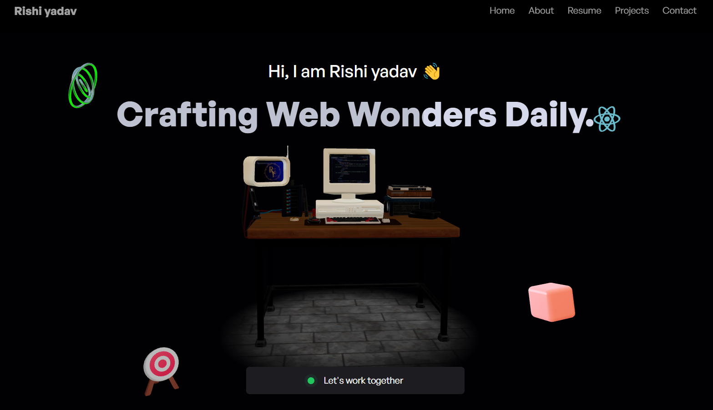

🚀 PortoForge
PortoForge is a powerful CLI tool that empowers developers to effortlessly generate professional portfolio websites. With a selection of over 20+ meticulously crafted templates, users can preview and select their desired design from our template gallery, and deploy a fully functional portfolio with a single command.

✨ Features
🎨 Diverse Templates: Choose from 20+ templates including React, Next.js, and pure HTML/CSS/JS.

🔍 Live Previews: Explore and preview templates in our online gallery.

⚙️ Easy Setup: Initialize your portfolio with a single CLI command.

📦 Automatic Dependency Installation: All necessary packages are installed seamlessly.

🚀 Ready to Deploy: Your portfolio is production-ready upon generation.

📸 Template Showcase

Explore our template gallery to find the perfect design that resonates with your style.

🛠️ Getting Started
Prerequisites
Node.js (v14 or higher)

npm (v6 or higher)

Installation
You can use npx to run PortoForge without installing it globally:

bash
Copy
Edit
npx create-portoforge
Alternatively, install it globally:

bash
Copy
Edit
npm install -g create-portoforge
Usage
Run the CLI tool:

bash
Copy
Edit
npx create-portoforge
Follow the prompts:

Enter Template ID: Choose a template ID from our template gallery.

Project Name: Specify the name of your new portfolio project.

The CLI will:

Download the selected template.

Install all necessary dependencies.

Set up your project directory.

Example
bash
Copy
Edit
npx create-portoforge
? Enter the template ID: react-modern-01
? Project name: my-portfolio
Your portfolio will be ready at ./my-portfolio.

📁 Template Structure
Each template is a complete project with the following structure:

java
Copy
Edit
my-portfolio/
├── public/
├── src/
│   ├── components/
│   ├── pages/
│   └── hooks/
├── package.json
├── README.md
└── ...
Note: Structure may vary slightly depending on the template.

🧩 Adding New Templates
We welcome contributions! To add a new template:

Fork the portoforge-templates repository.

Add your template folder with a unique ID.

Submit a pull request with a brief description and preview image.

🤝 Contributing
Contributions are what make the open-source community such an amazing place. Any contributions you make are greatly appreciated.

Fork the Project

Create your Feature Branch (git checkout -b feature/AmazingFeature)

Commit your Changes (git commit -m 'Add some AmazingFeature')

Push to the Branch (git push origin feature/AmazingFeature)

Open a Pull Request

📄 License
Distributed under the MIT License. See LICENSE for more information.

Crafted with ❤️ by Rishi yadav

Empowering developers to showcase their work with style and ease.

